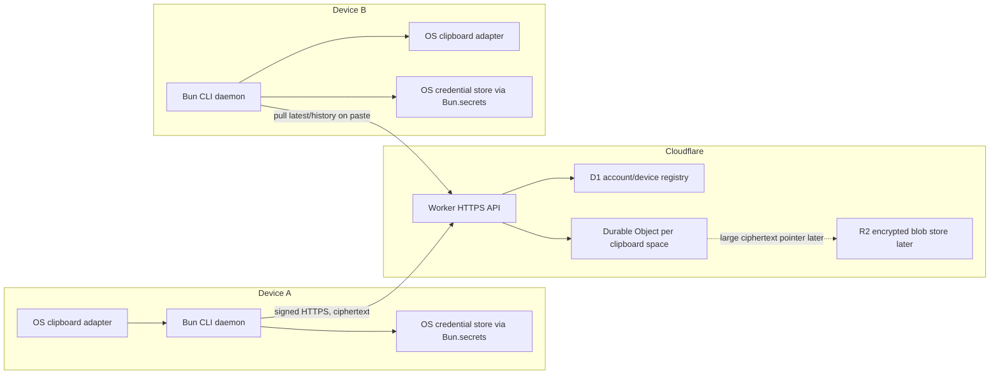

# Goal: Pasta MVP

Build a desktop-only clipboard tool that can be run from a public repository, starts as a daemon, auto-publishes copies, and lets another trusted desktop pull the latest encrypted clipboard entry on paste.

## Accepted Scope

- Desktop only: macOS, Linux, Windows.
- Primary UX: terminal-first CLI, daemon, shell/keybinding integration.
- First payload: text. Images and files move behind a later hardening goal.
- Transport: central Cloudflare relay is the only supported architecture. P2P, tailnets, STUN/TURN/WebRTC traversal, SSH, and LAN discovery are out of scope because firewall-constrained systems can block them; outbound HTTPS to a normal service is the workable path.
- Security: Cloudflare stores/routes ciphertext only. Device auth is app-owned, not Cloudflare Access, OAuth, or another Cloudflare identity product.
- Recovery: if all trusted devices are lost, reset the encrypted clipboard space. Do not build secret recovery into MVP.
- Distribution: public repo should support `bunx --bun github:thehumanworks/pasta...` if verified; npm and compiled binaries are fallback or release paths.

## Architecture



## Key Decisions

- **Central relay only**: use HTTPS to Cloudflare Workers and one Durable Object per clipboard space. P2P is no longer a design candidate, fallback, or future MVP path.
- **One Durable Object per clipboard space**: route by internal `routing_id`; it is required, but not secret and not user-facing in normal UX.
- **Device-owned interactions**: devices initiate every meaningful action. Copy publishes ciphertext; paste pulls `latest` or a history entry; pairing approval wraps keys. The central service coordinates and stores encrypted state but does not own clipboard intent.
- **Pull-on-paste is valid**: the MVP does not need continuous device sync. `paste` can pull `latest` from the relay, decrypt locally, set stdout/clipboard, and optionally append to local history.
- **Clean pairing UX**: no durable random ID or huge secret should be manually carried. The new device shows a short code or QR containing an ephemeral pairing request. An existing trusted device approves, wraps the group key for the new device, and the new device stores secrets in the OS credential store.
- **No plaintext fallback**: if OS secret storage is unavailable, authenticated commands fail with setup guidance.

## Goal Order

1. [Protocol and threat model](docs/goals/01-protocol-and-threat-model.md)
2. [Cloudflare relay backend](docs/goals/02-cloudflare-relay-backend.md)
3. [Bun CLI daemon text MVP](docs/goals/03-bun-cli-daemon-text-mvp.md)
4. [Pairing and device management](docs/goals/04-pairing-and-device-management.md)
5. [Distribution and terminal integration](docs/goals/05-distribution-and-terminal-integration.md)
6. [Binary payloads and hardening](docs/goals/06-binary-payloads-and-hardening.md)

## Research Pack

- [Consolidated findings](docs/research/consolidated-findings.md)
- [Adversarial review](docs/research/adversarial-review.md)
- [Fresh-session orchestration runbook](docs/ORCHESTRATION.md)

## Fresh-Session Handoff

A new Codex agent can continue from this repository if it starts at the project root, reads `AGENTS.md`, then follows `docs/ORCHESTRATION.md`.

Current verified state:

- Goals 01-05 are GDD-done with recorded evidence.
- Goal 05 Task 4 / DoD-4 uses live macOS smoke proof plus user-approved reasonable assumptions for Linux and Windows. Direct Linux/Windows smoke is not required for this checkpoint unless the proof standard changes.
- Goal 06 is the active remaining goal. Binary payloads and hardening are explicitly post-text-MVP work.

The current next action is Goal 06, Task 1:

```bash
python3 "$HOME/.agents/skills/goal-driven-development/scripts/gdd_status.py" docs/goals/06-binary-payloads-and-hardening.md
```

Work Goal 06 only with recorded evidence. Binary payload support must preserve the end-to-end encryption boundary.

## Completion Criteria

- [x] A fresh first device can bootstrap a clipboard space without external auth.
- [x] A second device can join by QR or short code approval from the first device.
- [x] Copying text on one device auto-publishes an encrypted entry.
- [x] Pasting on the other device pulls latest, decrypts locally, and writes to stdout or clipboard.
- [x] History lists append-only encrypted entries and can paste a selected entry.
- [x] Cloudflare storage never contains plaintext clipboard content or raw group keys.
- [x] `bunx` GitHub execution is verified from the public repo.
- [x] npm fallback and at least one local daemon flow are verified before claiming local usability.

## Current Blockers

- None for the encrypted text MVP.
- Goal 06 remains incomplete: images/files need R2 and streaming/chunking design after the text MVP distribution proof.
