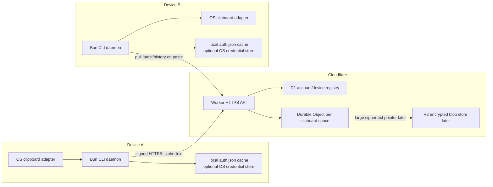

# Goal: Pasta MVP

Build a desktop-only clipboard tool that can be run from a public repository, starts as a daemon, auto-publishes copies, and lets another trusted desktop pull the latest encrypted clipboard entry on paste.

## Accepted Scope

- Desktop only: macOS, Linux, Windows.
- Primary UX: terminal-first CLI, daemon, shell/keybinding integration.
- First payload: text. Images and files move behind a later hardening goal.
- Transport: central Cloudflare relay is the only supported architecture. P2P, tailnets, STUN/TURN/WebRTC traversal, SSH, and LAN discovery are out of scope because firewall-constrained systems can block them; outbound HTTPS to a normal service is the workable path.
- Security: Cloudflare stores/routes ciphertext only. Device auth is app-owned, not Cloudflare Access, OAuth, or another Cloudflare identity product.
- Recovery: if all trusted devices are lost, reset the encrypted clipboard space. Do not build secret recovery into MVP.
- Distribution: public repo should support `bunx --bun github:thehumanworks/pasta...` if verified; npm and compiled binaries are fallback or release paths.

## Architecture



## Key Decisions

- **Central relay only**: use HTTPS to Cloudflare Workers and one Durable Object per clipboard space. P2P is no longer a design candidate, fallback, or future MVP path.
- **One Durable Object per clipboard space**: route by internal `routing_id`; it is required, but not secret and not user-facing in normal UX.
- **Device-owned interactions**: devices initiate every meaningful action. Copy publishes ciphertext; paste pulls `latest` or a history entry; pairing approval wraps keys. The central service coordinates and stores encrypted state but does not own clipboard intent.
- **Pull-on-paste is valid**: the MVP does not need continuous device sync. `paste` can pull `latest` from the relay, decrypt locally, set stdout/clipboard, and optionally append to local history.
- **Clean pairing UX**: no durable random ID or huge secret should be manually carried. The new device shows a short code or QR containing an ephemeral pairing request. An existing trusted device approves, wraps the group key for the new device, and the new device stores auth in the local `auth.json` cache.
- **Noninteractive sandbox pairing**: CI and Modal-style environments join through a trusted-device join grant with a short token TTL and one-use default. Joined devices are permanent by default, and the grant creator can opt into automatic revocation with a device TTL such as `--device-ttl 24h`.
- **Noninteractive auth by default**: device auth is cached in `$PASTA_HOME/auth.json` with owner-only permissions. OS credential storage is opt-in through settings or environment when a user wants keychain mirroring.

## Goal Order

1. [Protocol and threat model](docs/goals/01-protocol-and-threat-model.md)
2. [Cloudflare relay backend](docs/goals/02-cloudflare-relay-backend.md)
3. [Bun CLI daemon text MVP](docs/goals/03-bun-cli-daemon-text-mvp.md)
4. [Pairing and device management](docs/goals/04-pairing-and-device-management.md)
5. [Distribution and terminal integration](docs/goals/05-distribution-and-terminal-integration.md)
6. [Binary payloads and hardening](docs/goals/06-binary-payloads-and-hardening.md)
7. [Unified copy/paste UX](docs/goals/07-unified-copy-paste-ux.md)
8. [GitHub release artifacts](docs/goals/08-github-release-artifacts.md)
9. [Image copy reliability and history delete](docs/goals/09-image-copy-and-history-delete.md)
10. [Directory copy/paste](docs/goals/10-directory-copy-paste.md)
11. [Native iOS build environment](docs/goals/11-ios-build-environment.md)
12. [Native iOS shared core](docs/goals/12-ios-shared-core.md)
13. [Native iOS app shell pairing and history](docs/goals/13-ios-app-shell-pairing-history.md)
14. [Native iOS keyboard extension](docs/goals/14-ios-keyboard-extension.md)
15. [Native iOS publish surfaces](docs/goals/15-ios-publish-surfaces.md)
16. [Native iOS binary and File Provider handoff](docs/goals/16-ios-binary-file-provider-handoff.md)
17. [Native iOS integration and release readiness](docs/goals/17-ios-integration-release-readiness.md)

## Native iOS Expansion

The native iOS expansion follows the accepted keyboard-centered UX contract in
`docs-site/content/native-ios.md` and ADR
`docs/adrs/0001-native-ios-keyboard-centered.md`.

Current proposed implementation order:

1. Goal 11 creates the native iOS workspace seed, ADR, and goal stack.
2. Goal 12 ports Pasta protocol, crypto, signed requests, models, and secure
   storage to Swift.
3. Goal 13 adds the containing app for pairing, history, explicit clipboard
   import/export, and extension cache population.
4. Goal 14 adds the keyboard extension for normal typing and text history
   insertion where iOS allows third-party keyboards.
5. Goal 15 adds Share extension and App Intents publish surfaces.
6. Goal 16 completes image, file, directory, and File Provider handoff decisions.
7. Goal 17 proves Xcode Cloud build/test/archive evidence, end-to-end
   integration, device/simulator behavior, review copy, and release readiness.

Goals 11-17 are not a change to the completed desktop MVP scope. They are the
native iOS expansion queue and require user confirmation of each goal's DoD and
Tasks before execution ticks begin.

## Research Pack

- [Consolidated findings](docs/research/consolidated-findings.md)
- [Adversarial review](docs/research/adversarial-review.md)
- [Fresh-session orchestration runbook](docs/ORCHESTRATION.md)

## Fresh-Session Handoff

A new Codex agent can continue from this repository if it starts at the project root, reads `AGENTS.md`, then follows `docs/ORCHESTRATION.md`.

Current verified state:

- Goals 01-07 are GDD-done with recorded evidence.
- Goal 05 Task 4 / DoD-4 uses live macOS smoke proof plus user-approved reasonable assumptions for Linux and Windows. Direct Linux/Windows smoke is not required for this checkpoint unless the proof standard changes.
- Goal 06 completed binary payloads and hardening after the text MVP public distribution proof. Image clipboard smoke is live on macOS; Linux/Windows image clipboard behavior remains a documented platform assumption for this environment.
- Goal 07 completed the unified `copy`/`paste` image and file UX follow-up; old binary commands were removed after the follow-up no-compatibility requirement.
- Goal 10 completed the directory path copy/paste follow-up: `pasta copy <directory>` bundles regular directory contents as an encrypted zip-backed file payload, and `pasta paste` extracts the directory locally.
- Native iOS UX research is recorded in `docs-site/content/native-ios.md` and published in the docs site. The well-founded UX choice is a keyboard-centered iOS app: custom keyboard for text insertion, containing app for setup/history/trust, Share extension for publish, App Intents for command surfaces, and binary/file/directory handoff outside direct text insertion.
- The native iOS build environment seed is under `ios/` as a SwiftPM `PastaCore` package. Goal 11 is the active native iOS setup goal awaiting DoD/Task scope confirmation before GDD execution ticks.
- The current development host is macOS 27 beta 2. Local SwiftPM tests are acceptable for `PastaCore`, but Xcode app/extension build, archive, and release proof must come from Xcode Cloud.

The latest completed follow-up is directory copy/paste. Release artifact verification remains a later distribution action:

```bash
python3 "$HOME/.agents/skills/goal-driven-development/scripts/gdd_status.py" docs/goals/08-github-release-artifacts.md
python3 "$HOME/.agents/skills/goal-driven-development/scripts/gdd_status.py" --author docs/goals/11-ios-build-environment.md
swift test --package-path ios
mise exec -- bun run test
mise exec -- bunx tsc --noEmit
```

Binary payload support preserves the end-to-end encryption boundary.

## Completion Criteria

- [x] A fresh first device can bootstrap a clipboard space without external auth.
- [x] A second device can join by QR or short code approval from the first device.
- [x] Copying text on one device auto-publishes an encrypted entry.
- [x] Pasting on the other device pulls latest, decrypts locally, and writes to stdout or clipboard.
- [x] History lists append-only encrypted entries and can paste a selected entry.
- [x] Cloudflare storage never contains plaintext clipboard content or raw group keys.
- [x] `bunx` GitHub execution is verified from the public repo.
- [x] npm fallback and at least one local daemon flow are verified before claiming local usability.

## Current Blockers

- None.
