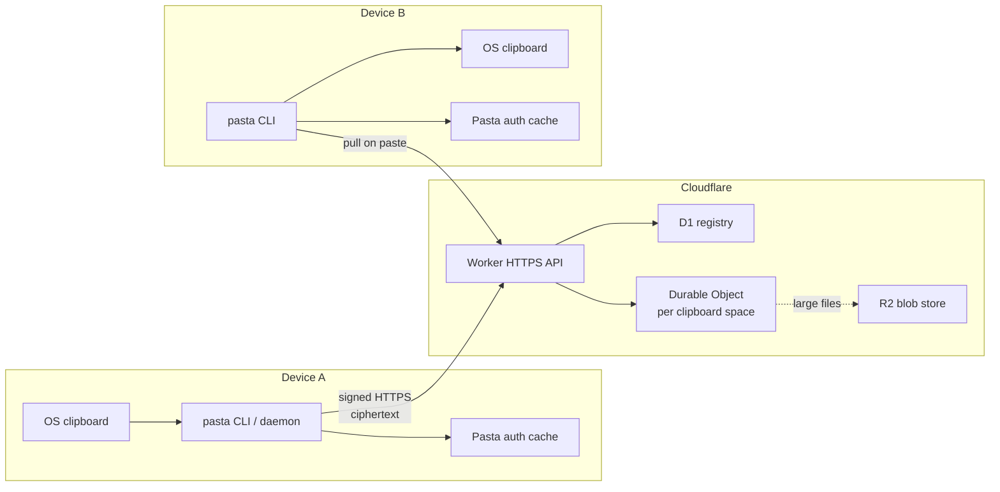

<!-- @human -->
## System diagram

## Design principles

**Device-initiated everything.** Copy publishes. Paste pulls. Pairing approval wraps keys. The relay never pushes clipboard content to devices.

**One Durable Object per clipboard space.** Each encrypted space has a `routing_id` that selects its DO instance. The routing id is internal — not a user-facing secret, but it partitions storage after reset.

**Registry vs state.** D1 holds accounts, devices, pairing sessions, and request nonces. The DO holds encrypted clip metadata, stable clip ids, gap-free display sequence numbers, and wrapped group-key grants.

**Inline vs R2.** Text and small payloads live inline in the DO. Files and large binary payloads go to R2 as encrypted bytes; the DO stores pointers and metadata only.

## Request flow: copy

1. CLI reads plaintext from stdin or OS clipboard.
2. Client encrypts with the local group key; builds AAD from account, routing, clip metadata.
3. Signed `POST /v1/clips` hits the Worker.
4. Worker verifies signature, nonce, timestamp, device status.
5. DO stores the ciphertext envelope under `clipId` and assigns display `seq`.
6. Response returns metadata (still ciphertext on the wire from Cloudflare's perspective — the body is encrypted).

## Request flow: paste

1. Signed `GET /v1/clips/latest` (or `/v1/clips/:clipId` after resolving a display sequence from history).
2. Worker returns stored envelope.
3. CLI decrypts locally with group key; writes stdout or OS clipboard.
4. Optional: records hash in config so daemon won't echo the paste back upstream.

## Trust boundaries

| Zone | Sees plaintext? | Sees group key? |
| --- | --- | --- |
| Device | Yes (when copying/pasting) | Yes (in local auth cache) |
| Worker | No | No |
| Durable Object | No | No (wrapped grants only) |
| D1 | No | No |
| R2 | No | No |

## What the relay can observe

Account IDs, routing IDs, device IDs, timestamps, sequence numbers, payload kind, MIME type, byte length, pairing activity, and IP-level request metadata. Pasta v0.1.10 does not attempt to hide usage patterns.

<!-- @agent -->
## Routing model

- `accountId` → D1 primary registry key (`acct_*`)
- `routingId` → Durable Object id (`space_*`); changes on `reset`
- Worker resolves DO via `env.CLIPBOARD.idFromName(routingId)`

## Worker entry (`src/worker/index.ts`)

Routes `/v1/*` paths. Auth middleware for signed routes:
1. Parse signature headers (`SIGNATURE_HEADERS` in protocol.ts)
2. Load device from D1; reject revoked
3. Verify Ed25519 over `canonicalRequest()`
4. Check timestamp within `REQUEST_TOLERANCE_MS`
5. Replay guard via D1 nonce store (`REQUEST_NONCE_TTL_MS`)

## ClipboardSpace DO (`src/worker/clipboard-space.ts`)

SQLite-backed DO state:
- Clip rows: clipId, display seq, ciphertext (inline) or r2 pointer, AAD hash, payload kind, expiry
- Wrapped group keys per device (pairing)
- Retention alarms for expired clips + R2 cleanup

## Client signing (`src/cli/client.ts`)

`FetchApiClient` builds canonical string, signs with `signingPrivateKey`, attaches headers. Unsigned routes: bootstrap, pairing open/consume.

## Identifier generators (`src/cli/config.ts`)

- `newAccountId()`, `newDeviceId()`, `newRoutingId()` — prefixed random ids

## File upload path

`POST /v1/files` → DO reserves clipId/display seq + clipId-based R2 key → Worker writes encrypted bytes to R2 → rollback DO row on R2 failure → schedule retention alarm.

## Tests

- `test/worker/backend.test.ts` — Workers pool integration (auth, pairing, no plaintext)
- `test/bun/cli.test.ts` — CLI with mocks

## Related source docs

- `docs/protocol.md`
- `docs/threat-model.md`
- `docs/binary-payloads.md`
